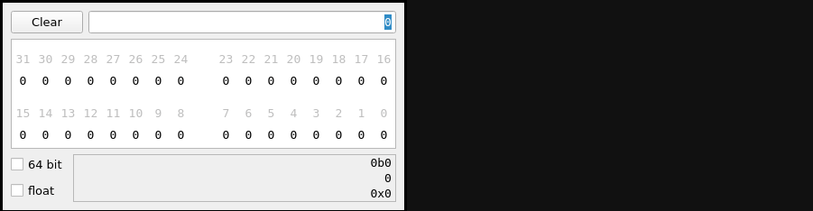

# procal: A simple Qt-based programming calculator

Any python code that can be `eval()`'d and cast to float without raising an
exception is accepted. The binary representation of the result is shown in the
table, and the binary, decimal, and hexadecimal representation is displayed at
the bottom. Floats, 64 bit numbers and signed integers are supported too.

Bits in the binary table can be toggled by clicking them (click and drag to
toggle a range of bits). Right-clicking a bit turns it into a sign bit, which
makes the decimal representation negative.

## why?
I wrote this after some frustration with the default Gnome calculator's
programming mode:
1. Not each bit is labeled, and I'd rather not count bits if I can avoid it.
2. You cannot click-and-drag to toggle multiple bits in gnome-calc.
3. gnome-calc does not understand hex strings starting with `0x`, making
   copy-pasting from datasheets or code more of a hassle.
4. I wanted to play around with Qt.